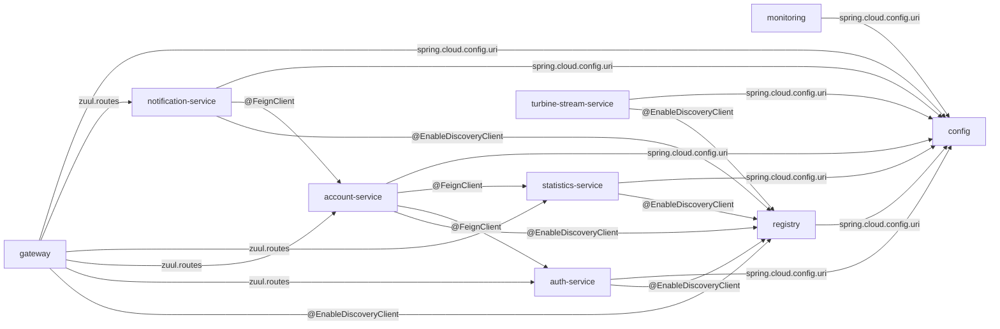
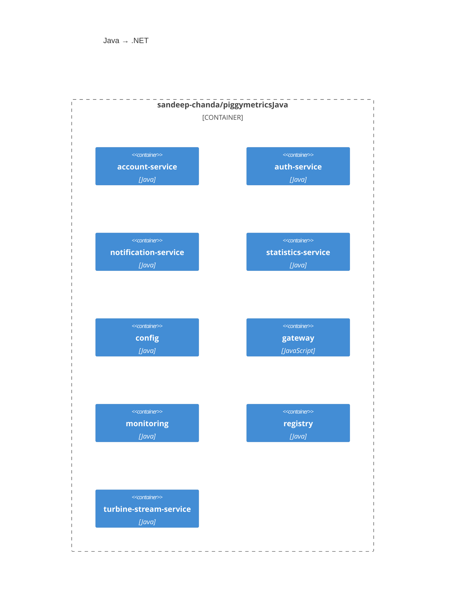
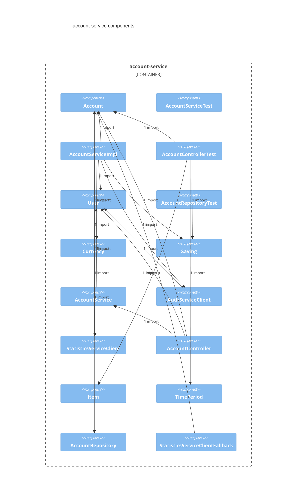
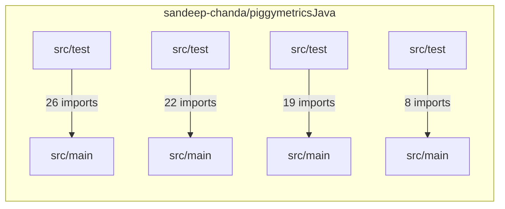

# Java → .NET

## Intent
Java → .NET

## Summary
piggymetricsJava is 9 Maven modules (account-service, auth-service, config, gateway, monitoring, notification-service, registry, statistics-service, turbine-stream-service) · 97 Java files. PiggyMetricsDotNet is the destination (separate repo); PiggyMetricsDotNet is not indexed, so 0 of 9 Maven modules map and every unit stays unmapped until it is indexed. The index states 21 edges (3 Feign clients, 4 gateway routes, config and registry imports); 0 modules carry no resolved edge. Decisions proposed from the source's annotations: Spring Cloud → ASP.NET Core; Eureka → none; Feign → HttpClient; Zuul → YARP; Spring Security OAuth → ASP.NET Identity. Plans: 6 across 3 waves, 0 hours · 0 tokens from the Brief.

## Inventory
- 9 modules · 97 Java files · 0 of 9 mapped · destination has no indexed files
- account-service · module · account-service/ → AccountService · unmapped
- auth-service · module · auth-service/ → AuthService · unmapped
- config · module · config/ → Config · unmapped
- gateway · module · gateway/ → Gateway · unmapped
- monitoring · module · monitoring/ → Monitoring · unmapped
- notification-service · module · notification-service/ → NotificationService · unmapped
- registry · module · registry/ → Registry · unmapped
- statistics-service · module · statistics-service/ → StatisticsService · unmapped
- turbine-stream-service · module · turbine-stream-service/ → TurbineStreamService · unmapped

## Scope
- In: reimplement the 9 Maven modules of piggymetricsJava as separate PiggyMetricsDotNet units, one per source Maven module: account-service → AccountService; auth-service → AuthService; config → Config; gateway → Gateway; monitoring → Monitoring; notification-service → NotificationService; registry → Registry; statistics-service → StatisticsService; turbine-stream-service → TurbineStreamService.
- Out: destination prefixes and paths — destination not indexed; nothing under PiggyMetricsDotNet is cited until its index holds files.
- Out: parity percentages — the run writes them on the Parity rows.

## Acceptance criteria
- Inventory lists 9 modules with paths that resolve in the source index; destination units map once PiggyMetricsDotNet is indexed
- wave 2 holds parity on account-service · auth-service · config · gateway · monitoring · notification-service · registry · statistics-service · turbine-stream-service
- wave 3 holds parity and Cutover no longer waits

## Architecture
**Module view**




**Container view**




**Component view**




**Module dependencies**



- 9 Maven modules · 21 edges from the index · PiggyMetricsDotNet is not indexed
- account-service → registry · @EnableDiscoveryClient · account-service/src/main/java/com/piggymetrics/account/AccountApplication.java:L12
- auth-service → registry · @EnableDiscoveryClient · auth-service/src/main/java/com/piggymetrics/auth/AuthApplication.java:L11
- gateway → registry · @EnableDiscoveryClient · gateway/src/main/java/com/piggymetrics/gateway/GatewayApplication.java:L9
- notification-service → registry · @EnableDiscoveryClient · notification-service/src/main/java/com/piggymetrics/notification/NotificationServiceApplication.java:L19
- statistics-service → registry · @EnableDiscoveryClient · statistics-service/src/main/java/com/piggymetrics/statistics/StatisticsApplication.java:L22
- turbine-stream-service → registry · @EnableDiscoveryClient · turbine-stream-service/src/main/java/com/piggymetrics/turbine/TurbineStreamServiceApplication.java:L10
- account-service → auth-service · @FeignClient · account-service/src/main/java/com/piggymetrics/account/client/AuthServiceClient.java:L9
- account-service → statistics-service · @FeignClient · account-service/src/main/java/com/piggymetrics/account/client/StatisticsServiceClient.java:L10
- notification-service → account-service · @FeignClient · notification-service/src/main/java/com/piggymetrics/notification/client/AccountServiceClient.java:L9
- account-service → config · spring.cloud.config.uri · account-service/src/main/resources/bootstrap.yml:L6
- auth-service → config · spring.cloud.config.uri · auth-service/src/main/resources/bootstrap.yml:L6
- gateway → auth-service · zuul.routes · config/src/main/resources/shared/gateway.yml:L20
- gateway → account-service · zuul.routes · config/src/main/resources/shared/gateway.yml:L26
- gateway → statistics-service · zuul.routes · config/src/main/resources/shared/gateway.yml:L32
- gateway → notification-service · zuul.routes · config/src/main/resources/shared/gateway.yml:L38
- gateway → config · spring.cloud.config.uri · gateway/src/main/resources/bootstrap.yml:L6
- monitoring → config · spring.cloud.config.uri · monitoring/src/main/resources/bootstrap.yml:L6
- notification-service → config · spring.cloud.config.uri · notification-service/src/main/resources/bootstrap.yml:L6
- registry → config · spring.cloud.config.uri · registry/src/main/resources/bootstrap.yml:L6
- statistics-service → config · spring.cloud.config.uri · statistics-service/src/main/resources/bootstrap.yml:L6
- turbine-stream-service → config · spring.cloud.config.uri · turbine-stream-service/src/main/resources/bootstrap.yml:L6

## Parity
- golden set · none — a pre-condition names it
- wave 1 · Inventory · —
- wave 2 · Parity · —
- wave 3 · Cutover · —
- 0 of 3 waves hold · Parity is a gate on Cutover, not on this spec

## Decisions
```decision
chosen: drop
chosen: AFD walk 21 — answered on the walk
chosen: AFD walk 21 — answered on the walk
chosen: remove
chosen: AFD walk 21 — answered on the walk
chosen: AFD walk 21 — answered on the walk
chosen: drop
chosen: AFD walk 21 — answered on the walk
chosen: AFD walk 21 — answered on the walk
chosen: AFD walk 21 — answered on the walk
rejected: Re-anchor the moved ones | AFD walk 21 — answered on the walk | AFD walk 21 — answered on the walk
rejected: Queue a re-scan · the index may be missing a source | AFD walk 21 — answered on the walk | AFD walk 21 — answered on the walk
rejected: This repo is in scope · add it to the scenario | AFD walk 21 — answered on the walk | AFD walk 21 — answered on the walk
rejected: Big-bang cutover | no dual running | nothing ships until the whole port lands
```

## Work
- Map each of the 9 Maven modules to a PiggyMetricsDotNet unit; do not merge account-service, auth-service, notification-service, statistics-service, turbine-stream-service.
- Attach hours and tokens on every plan · done: 40 h · 80,000 tokens per plan.
- Cite no PiggyMetricsDotNet path until its index holds files.

## Phases
- Wave 1 · Inventory
  - Do: account-service → AccountService
  - Do: auth-service → AuthService
  - Do: config → Config
  - Do: gateway → Gateway
  - Do: monitoring → Monitoring
  - Do: notification-service → NotificationService
  - Do: registry → Registry
  - Do: statistics-service → StatisticsService
  - Do: turbine-stream-service → TurbineStreamService
  - Do: Scaffold one destination module per source module in PiggyMetricsDotNet; cite no destination path the index does not hold
  - Done when: Inventory lists 9 modules with paths that resolve in the source index; destination units map once PiggyMetricsDotNet is indexed
- Wave 2 · Parity
  - Do: Implement every source module on the destination with the source's HTTP contract
  - Do: Replay the golden set through source and destination
  - Done when: wave 2 holds parity on account-service · auth-service · config · gateway · monitoring · notification-service · registry · statistics-service · turbine-stream-service
- Wave 3 · Cutover
  - Do: Destination takes live traffic through the gateway routes
  - Do: Source runs shadow against the golden set
  - Done when: wave 3 holds parity and Cutover no longer waits

## Guardrails
- H1: the ends are the Brief's — source sandeep-chanda/piggymetricsJava, destination sandeep-chanda/PiggyMetricsDotNet; never inferred from a name.
- Cite only paths the source index resolves until PiggyMetricsDotNet is indexed.
- No copybook counts on a Maven module repo: Inventory is the Maven module scan.
- Waived · grounded · AFD walk 21 — by decision · s.chanda@rebuildworks.ai

## Cutover
- waits on Parity · 0 of 3 waves hold
- wave 1 · Inventory · destination takes the batch · source runs shadow · waits on parity
- wave 2 · Parity · destination takes the batch · source runs shadow · waits on parity
- wave 3 · Cutover · destination takes the batch · source runs shadow · waits on parity

## Impacted assets
- AFD walk 21 — answered on the walk

## Change plan
- account-service/pom.xml · account-service — Wave 1 · Inventory · account-service → AccountService · scaffold the destination Maven module; cite no PiggyMetricsDotNet path until it is indexed
- auth-service/pom.xml · auth-service — Wave 1 · Inventory · auth-service → AuthService · scaffold the destination Maven module; cite no PiggyMetricsDotNet path until it is indexed
- config/pom.xml · config — Wave 1 · Inventory · config → Config · scaffold the destination Maven module; cite no PiggyMetricsDotNet path until it is indexed
- gateway/pom.xml · gateway — Wave 1 · Inventory · gateway → Gateway · scaffold the destination Maven module; cite no PiggyMetricsDotNet path until it is indexed
- monitoring/pom.xml · monitoring — Wave 1 · Inventory · monitoring → Monitoring · scaffold the destination Maven module; cite no PiggyMetricsDotNet path until it is indexed
- notification-service/pom.xml · notification-service — Wave 1 · Inventory · notification-service → NotificationService · scaffold the destination Maven module; cite no PiggyMetricsDotNet path until it is indexed
- registry/pom.xml · registry — Wave 1 · Inventory · registry → Registry · scaffold the destination Maven module; cite no PiggyMetricsDotNet path until it is indexed
- statistics-service/pom.xml · statistics-service — Wave 1 · Inventory · statistics-service → StatisticsService · scaffold the destination Maven module; cite no PiggyMetricsDotNet path until it is indexed
- turbine-stream-service/pom.xml · turbine-stream-service — Wave 1 · Inventory · turbine-stream-service → TurbineStreamService · scaffold the destination Maven module; cite no PiggyMetricsDotNet path until it is indexed

## Test plan
- Wave 1 · Inventory: 9 Maven modules resolve in the source index; destination units stay unmapped until PiggyMetricsDotNet is indexed.
- Wave 2 · Parity: replay the golden set the first pre-condition names through source and destination; record the percent on each Parity row.
- Wave 3 · Cutover: the same golden set through the destination behind the gateway routes.
- Characterization: the 25 test files under src/test/java run against the source before each wave.

## Rollout
- Wave by wave: destination units deploy behind the same route prefixes; the source gateway stays until wave 3.
- Wave 3 switches the gateway routes to PiggyMetricsDotNet.

## Rollback
- Flip the gateway routes back to the source units; the source stays runnable through wave 3.
- Rollback is traffic, not data: each unit keeps its own store.

## Risk
- Destination not indexed: 0 of 9 mapped; any PiggyMetricsDotNet path would fail gate_resolved, so none is cited.
- Hours are the Brief's per-plan budget (40 per plan · 240 total) until a person changes them.
- Edges are what the index states (0); a call the annotations and yaml do not declare is not drawn.

## Estimate
total: 240 hours
unhelped: 0 of 240 hours
6 plans · 240 hours · 480,000 tokens from the Brief; 0 hours on no harness. Priced per configured harness on save.

## Open questions
- Nothing indexed for the selected objects yet.
- 37 of 37 marker files were not readable
- Index PiggyMetricsDotNet to map destinations · destination has no indexed files

## Todo
- [ ] Confirm scope and impacted assets
- [ ] Add verification steps to the test plan
- [ ] Fill rollout and rollback
- [ ] Extend sandeep-chanda/piggymetricsJava
- [ ] Extend sandeep-chanda/PiggyMetricsDotNet
- [ ] Review sandeep-chanda/piggymetricsJava
- [ ] Review sandeep-chanda/PiggyMetricsDotNet

## Plans
### P1 · Wave 1 · Inventory · piggymetricsJava → PiggyMetricsDotNet · destination
Inventory lists 9 modules with paths that resolve in the source index; destination units map once PiggyMetricsDotNet is indexed

1. account-service → AccountService
2. auth-service → AuthService
3. config → Config
4. gateway → Gateway
5. monitoring → Monitoring
6. notification-service → NotificationService
7. registry → Registry
8. statistics-service → StatisticsService
9. turbine-stream-service → TurbineStreamService
10. Scaffold one destination module per source module in PiggyMetricsDotNet; cite no destination path the index does not hold

### P2 · Wave 1 · Inventory · piggymetricsJava → PiggyMetricsDotNet · source
parity harness for account-service · auth-service · config · gateway · monitoring · notification-service · registry · statistics-service · turbine-stream-service

1. Add the parity harness for account-service · auth-service · config · gateway · monitoring · notification-service · registry · statistics-service · turbine-stream-service
2. Replay the golden set through the source for wave 1

### P3 · Wave 2 · Parity · piggymetricsJava → PiggyMetricsDotNet · destination
wave 2 holds parity on account-service · auth-service · config · gateway · monitoring · notification-service · registry · statistics-service · turbine-stream-service

1. Implement every source module on the destination with the source's HTTP contract
2. Replay the golden set through source and destination

### P4 · Wave 2 · Parity · piggymetricsJava → PiggyMetricsDotNet · source
parity harness for account-service · auth-service · config · gateway · monitoring · notification-service · registry · statistics-service · turbine-stream-service

1. Add the parity harness for account-service · auth-service · config · gateway · monitoring · notification-service · registry · statistics-service · turbine-stream-service
2. Replay the golden set through the source for wave 2

### P5 · Wave 3 · Cutover · piggymetricsJava → PiggyMetricsDotNet · destination
wave 3 holds parity and Cutover no longer waits

1. Destination takes live traffic through the gateway routes
2. Source runs shadow against the golden set

### P6 · Wave 3 · Cutover · piggymetricsJava → PiggyMetricsDotNet · source
parity harness for account-service · auth-service · config · gateway · monitoring · notification-service · registry · statistics-service · turbine-stream-service

1. Add the parity harness for account-service · auth-service · config · gateway · monitoring · notification-service · registry · statistics-service · turbine-stream-service
2. Replay the golden set through the source for wave 3

## Citations
[^1]: AFD walk 21 — answered on the walk

## Open items
- grounded · architecture — AFD walk 21 — stays open · s.chanda@rebuildworks.ai
- grounded · architecture — AFD walk 21 — stays open · s.chanda@rebuildworks.ai
- grounded · summary — AFD walk 21 — stays open · s.chanda@rebuildworks.ai
- decisions_argued · decisions — AFD walk 21 — stays open · s.chanda@rebuildworks.ai
- decisions_argued · decisions — AFD walk 21 — stays open · s.chanda@rebuildworks.ai
- decisions_argued · decisions — AFD walk 21 — stays open · s.chanda@rebuildworks.ai
- decisions_argued · decisions — AFD walk 21 — stays open · s.chanda@rebuildworks.ai
- decisions_argued · decisions — AFD walk 21 — stays open · s.chanda@rebuildworks.ai
